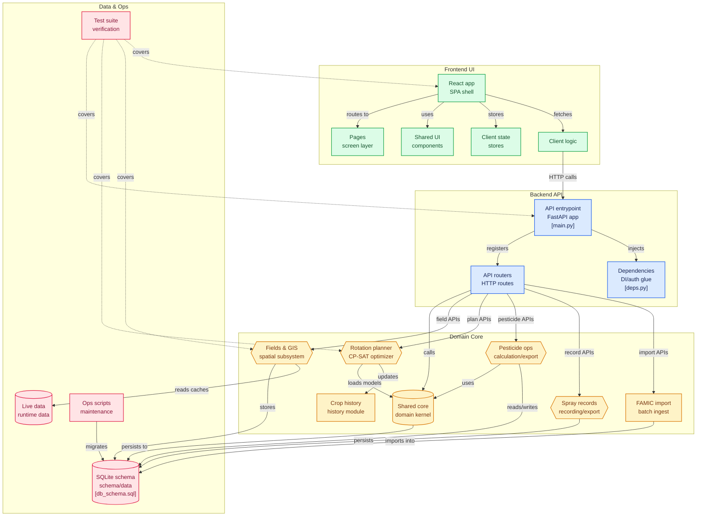

# 農業管理アプリ（Rotation Planner）

北海道畑作農家向けの統合農業管理アプリケーション。
ほ場管理・輪作計画・農薬発注・防除記録を一元管理し、OR-Toolsによる最適化で科学的な輪作計画を自動生成する。

## アーキテクチャ



## 主な機能

| 機能 | 説明 |
|------|------|
| 🌱 作物設定 | 作付する作物を選択・カスタム作物追加 |
| 🗺️ ほ場登録 | 地図上でほ場を登録（筆ポリゴン対応・KML/KMZインポート） |
| 🗺️ ほ場一覧 | 年度別作物をマトリックス形式で表示・編集 |
| 🌾 作付けポリゴン管理 | 同一ほ場内の作物別ポリゴン登録・前年コピー・KMLインポート |
| 🌾 水田ポリゴン管理 | 水田ポリゴン登録・畑地化フラグ管理・KMLインポート |
| 📊 地目別集計 | 作物×地目（畑/畑地化済/水田）クロス集計・畑地化年度別面積集計 |
| 🌾 輪作計画 | OR-Tools CP-SATソルバーによる最適な輪作計画自動生成・PDF出力 |
| 💊 農薬発注 | 輪作計画から年間の農薬必要量を算出・PDF出力 |
| 💊 FAMIC農薬インポーター | 農薬検査所（FAMIC）公式XLSデータの一括取込 |
| 🧪 防除記録 | 農薬散布記録の管理・画像解析によるラベル読取 |
| 📥 データ管理 | CSV一括インポート/エクスポート・テンプレート提供 |
| ⚙️ 管理 | ユーザー管理・バックアップ・筆ポリゴンアップロード |

## 技術スタック

| 種別 | 技術 |
|------|------|
| フロントエンド | React 18+ (Vite) |
| バックエンド | FastAPI + Uvicorn |
| 認証 | JWT（PyJWT） |
| 言語 | Python 3.11+ |
| DB | SQLite（22テーブル） |
| 最適化 | Google OR-Tools CP-SAT ソルバー |
| 地理空間 | Shapely 2.0+ / Pyproj 3.0+ / Leaflet.js |
| PDF出力 | ReportLab 4.0+ |
| データ処理 | Pandas 2.0+ / NumPy 1.24+ |
| E2Eテスト | Playwright |

## クイックスタート

```bash
git clone https://github.com/yasunorioi/rotation-planner.git
cd rotation-planner
python3 -m venv venv
source venv/bin/activate
pip install -r requirements.txt
pip install -r api/requirements.txt

# フロントエンド依存インストール
cd frontend/app && npm install && cd ../..

# DB初期化
python3 -c "from rotation_planner.common.db import init_db; init_db()"

# 開発サーバー起動（API + React）
bash start-dev.sh
# → API:   http://localhost:8000
# → React: http://localhost:5173
```

### 初期ユーザー

| ユーザー名 | パスワード | ロール |
|-----------|-----------|--------|
| admin | admin123 | 管理者 |
| ja_staff | ja123 | JA職員 |
| farmer_demo | demo123 | 農家（デモ用） |

> ⚠️ **本番環境では必ず初期パスワードを変更してください**

## ユーザーロール

| ロール | 権限 |
|--------|------|
| admin | 全機能 + ユーザー管理 + システム設定 |
| ja_staff | 全機能 + 農家一覧 + 防除マスタ管理 + 農薬集約発注 |
| farmer | 基本機能（作物設定〜農薬発注） |

## 機能詳細

### 🌱 作物設定

- マスタから作付する作物を選択
- カスタム作物の追加（例: ブロッコリー（2作目））
- 選択した作物がほ場登録や輪作計画で使用可能に
- **自動保存**: チェックボックス変更時に即座にDB保存

### 🗺️ ほ場登録

- OpenStreetMap + Leaflet.jsによる地図表示（Leaflet.drawプラグインでポリゴン描画）
- WGS84楕円体による正確な測地面積計算（Shapely + Pyproj）
- ほ場登録時に作付年度・作物を同時設定可能

#### 対応インポート形式

| 形式 | 説明 |
|------|------|
| KML/KMZ | Google Earth形式。Placemark/Polygon、Placemark/LineStringに対応 |
| CSV | テンプレートによる一括登録 |
| 筆ポリゴン | 農水省公開データ（GeoJSON形式、手動ダウンロード） |

#### 筆ポリゴン連携

農林水産省「筆ポリゴンデータ」（https://open.fude.maff.go.jp/）から農地区画情報を取り込み可能。

- バウンディングボックス指定で該当範囲の筆ポリゴンを検索
- 地方公共団体コードによる逆ジオコーディング（北海道全市町村対応）
- GeoJSONファイルの `data/fude_cache/` へのローカルキャッシュ

> **注意**: 筆ポリゴンデータの利用には農水省の利用規約への同意が必要。自動ダウンロードは非対応のため、手動で `data/fude_cache/` にGeoJSONファイルを配置する。

### 🗺️ ほ場一覧

- ほ場×年度のマトリックス形式で作物を表示・編集
- 令和年度形式（R5〜R9など）で年度範囲を指定
- ほ場情報（ID、名前、地区、面積、禁止フラグ）のインライン編集
- 輪作計画結果の微調整が可能

### 🌾 作付けポリゴン管理

同一ほ場内で複数の作物が混在する場合に、作物別の区画を管理する機能。

- **年度別ポリゴン登録**: ほ場ごとに年度・作物を指定してポリゴンを描画
- **KML/KMZインポート**: Google Earth等で作成した区画図を取込
- **前年コピー**: 前年の作付けポリゴンを今年度にコピー
- **面積自動計算**: 測地面積（ha）を自動算出
- 対応テーブル: `crop_polygons`（field_id, year, crop_name, geometry, area_ha）

### 🌾 輪作計画

#### 最適化エンジン

2つのソルバーを搭載:

| ソルバー | 特徴 |
|---------|------|
| OR-Tools CP-SAT（デフォルト） | Google制約プログラミングソルバー。厳密解を探索 |
| ヒューリスティック（フォールバック） | 貪欲法 + ローカルサーチ。高速だが近似解 |

#### 制約設定

**ハード制約（必ず満たす）:**

| 制約 | 説明 | 設定場所 |
|------|------|---------|
| 連作禁止 | 同一作物の連続作付を禁止 | 固定（常に有効） |
| 禁止遷移（固定） | てんさい→秋小麦（作期重複）、春小麦→秋小麦（病害対策） | 固定 |
| 禁止遷移（ユーザー定義） | 任意の作物ペアの遷移を禁止 | `forbidden_transitions` |
| 作付間隔 | 作物ごとの最小間隔年数（例: てんさい・馬鈴薯は4年） | `min_gap_years` |
| てんさい禁止フラグ | `beet_forbidden=1` のほ場でてんさい・馬鈴薯を禁止 | ほ場登録時に設定 |

**ソフト制約（ペナルティ付き最適化）:**

| 制約 | 説明 | 設定場所 |
|------|------|---------|
| 面積上限 | 作物ごとの年間最大ha数 | `cap_ha` |
| 面積下限 | 作物ごとの年間最小ha数 | `min_ha` |
| ほ場数制限 | 作物ごとの最小・最大ほ場数 | `min_fields` / `max_fields` |
| 優先遷移 | 望ましい作物遷移にボーナス（例: てんさい→大豆:10） | `preferred_transitions` |
| 主作物安定 | 主要作物の年間面積変動を抑制 | `main_crops` |
| 地区まとめ | 同一地区に同一作物を集約 | UI チェックボックス |
| 隣接筆同一科制約 | 隣接ほ場での同一科作物を抑制（空間演算で隣接判定） | UI チェックボックス（PRO機能） |

#### 不明年の取扱モード

| モード | 動作 |
|--------|------|
| ignore（推奨） | 不明年は制約なしとして扱う |
| safe | 不明年はワーストケース（全禁止作物の可能性あり）として扱う |

#### 推論モード

- 作付履歴の不明年を制約ベースの推論で自動補完
- 推論された履歴は `is_inferred=1` フラグで区別

#### ボトルネック分析

- 各制約を個別に緩和して改善ポテンシャルを分析
- どの制約が最適化の品質を最も制限しているかを特定

#### 出力

- **PDF/CSV出力**: 計画をダウンロード
- **作付履歴に保存**: 生成した計画を直接作付履歴に反映

### 💊 農薬発注

- 輪作計画から対象年の農薬必要量を自動計算
- 月別詳細スケジュール表示
- 在庫控除: `inventory` テーブルの手持ち在庫を差し引き
- **DB保存**: 発注リストを名前を付けて保存（`order_templates` テーブル）
- **PDF出力**: 印刷用フォーマットでダウンロード
- **保存済み一覧**: 過去の発注リストを読み込み/削除

#### JA職員向け集約機能

- JA管内の全農家の農薬発注を集約
- 農薬名ごとの合計数量を算出
- 農家別内訳の確認
- 一括発注CSVのエクスポート

### 💊 FAMIC農薬インポーター

農薬検査所（FAMIC）が公開する農薬登録情報XLSファイルをDBに一括取込する機能。

- **データソース**: https://www.acis.famic.go.jp/ddownload/index.htm
- **依存ライブラリ**: `xlrd`（XLS読み込み）

| インポート関数 | 対象ファイル | 取込先テーブル |
|---------------|-------------|---------------|
| `import_famic_basic()` | 登録基本部.xls | `pesticide_registry`（登録番号、名称、製造者、有効成分、剤型） |
| `import_famic_usage()` | 登録適用部一/二.xls | `pesticide_usage`（作物名、適用病害虫、希釈倍数、使用時期、使用回数） |

- インポート履歴は `famic_import_log` テーブルに記録
- `get_import_stats()` で現在のインポート状況を確認可能

### 🧪 防除記録

- ほ場ごとの農薬散布記録管理
- 散布日、農薬名、希釈倍率、散布量を記録
- 履歴の編集・削除
- CSV/PDFエクスポート（農薬取締法準拠フォーマット）

#### 画像解析機能

- 農薬ラベルの画像から情報を抽出（`image_analyzer.py`）
- Tesseract OCR + OpenCV による前処理
- 農薬名、登録番号、有効成分、希釈倍率を自動認識

### 🌾 水田・畑地化管理

- **水田ポリゴン登録**: 地図上で水田境界を描画・登録（KML/KMZインポート対応）
- **畑地化フラグ管理**: 水田ポリゴンごとに畑地化フラグ（`is_converted`）と開始年度を設定
- **データソース**: `maff`（農水省筆ポリゴン）/ `kml`（Google Earth）/ `manual`（手動描画）
- **地目自動判定**: 作付けポリゴンと水田ポリゴンの空間演算（Shapely）で地目を自動分類
  - **畑**: 作付けポリゴンのうち水田ポリゴンに重ならない部分
  - **畑地化済**: 畑地化フラグ（`is_converted=true`）の水田ポリゴンと重なる部分
  - **水田**: 畑地化フラグ（`is_converted=false`）の水田ポリゴンと重なる部分
- **地目×作物クロス集計**: 作物を行、地目を列としたクロス集計表を生成
- **畑地化開始年度別面積集計**: 畑地化の開始年度別に面積を集計（補助金申請用）

#### データフロー

```
1. 水田ポリゴン登録（paddy_crud.py）
2. 作付けポリゴン登録（crop_polygon_crud.py）
3. 空間演算で地目判定（spatial.py）
4. 集計処理（aggregation.py → aggregation_service.py）
5. React画面で表示（Fields.jsx / Dashboard.jsx）
```

### 📥 データ管理

- ほ場データのCSVインポート/エクスポート
- 作付履歴のCSVインポート/エクスポート
- 防除マスタのCSVインポート/エクスポート
- バリデーション機能（空欄チェック、未登録作物チェック）
- **テンプレート提供**: ほ場・制約・在庫・輪作計画のCSVテンプレートをダウンロード可能
- **DBバックアップ**: SQLiteデータベースのダンプ

### ⚙️ 管理（admin専用）

- ユーザー管理（追加/削除/パスワードリセット/ロール変更）
- システム情報表示
- データバックアップ
- 筆ポリゴンアップロード
- デバッグモード切り替え

## サーバーデプロイ（VPS）

### 手動インストール

```bash
git clone https://github.com/yasunorioi/rotation-planner.git
cd rotation-planner

# Python環境
python3 -m venv venv
source venv/bin/activate
pip install -r requirements.txt
pip install -r api/requirements.txt

# フロントエンドビルド
cd frontend/app && npm install && npm run build && cd ../..

# DB初期化
python3 -c "from rotation_planner.common.db import init_db; init_db()"

# API起動
uvicorn api.main:app --host 0.0.0.0 --port 8000
```

### 動作確認済み環境

- Debian 12 / Ubuntu 22.04
- Python 3.11+
- Node.js 18+
- メモリ 512MB以上

### systemdサービス設定

```bash
sudo tee /etc/systemd/system/rotation-planner.service << 'EOF'
[Unit]
Description=Rotation Planner FastAPI
After=network.target

[Service]
Type=simple
User=webapp
WorkingDirectory=/var/www/rotation-planner/app
ExecStart=/var/www/rotation-planner/app/venv/bin/uvicorn api.main:app --host 127.0.0.1 --port 8000
Restart=always
RestartSec=3

[Install]
WantedBy=multi-user.target
EOF

sudo systemctl daemon-reload
sudo systemctl enable rotation-planner
sudo systemctl start rotation-planner
```

### nginx設定

```bash
sudo tee /etc/nginx/sites-available/rotation-planner << 'EOF'
server {
    listen 80;
    server_name YOUR_DOMAIN_OR_IP;

    # React静的ファイル
    root /var/www/rotation-planner/app/frontend/app/dist;
    index index.html;

    location / {
        try_files $uri $uri/ /index.html;
    }

    # FastAPI
    location /api/ {
        proxy_pass http://127.0.0.1:8000;
        proxy_set_header Host $host;
        proxy_set_header X-Real-IP $remote_addr;
        proxy_set_header X-Forwarded-For $proxy_add_x_forwarded_for;
        proxy_set_header X-Forwarded-Proto $scheme;
    }
}
EOF

sudo ln -sf /etc/nginx/sites-available/rotation-planner /etc/nginx/sites-enabled/
sudo rm -f /etc/nginx/sites-enabled/default
sudo nginx -t && sudo systemctl restart nginx
```

## 運用コマンド

```bash
# サービス状態確認
sudo systemctl status rotation-planner

# ログ確認
sudo journalctl -u rotation-planner -f

# 再起動
sudo systemctl restart rotation-planner
```

## ファイル構成

```
rotation-planner/
├── api/                               # FastAPI バックエンド
│   ├── main.py                        # アプリエントリポイント
│   ├── deps.py                        # 依存性注入（DB, 認証）
│   ├── requirements.txt               # API依存ライブラリ
│   ├── routers/                       # APIルーター
│   │   ├── admin.py                   # 管理機能API
│   │   ├── auth.py                    # 認証API（JWT）
│   │   ├── crops.py                   # 作物API
│   │   ├── dashboard.py               # ダッシュボードAPI
│   │   ├── fields.py                  # ほ場API
│   │   ├── gis.py                     # GIS/ポリゴンAPI
│   │   ├── pesticides.py              # 農薬API
│   │   └── plans.py                   # 輪作計画API
│   └── inventory_api.py               # 在庫API
│
├── frontend/                          # React フロントエンド
│   └── app/
│       └── src/
│           ├── pages/                 # ページコンポーネント
│           │   ├── Login.jsx
│           │   ├── Dashboard.jsx
│           │   ├── Fields.jsx
│           │   ├── FieldRegister.jsx
│           │   ├── CropSettings.jsx
│           │   ├── DataManagement.jsx
│           │   ├── JAAggregation.jsx
│           │   └── PesticideMasters.jsx
│           ├── components/            # 共通コンポーネント
│           └── store/                 # 状態管理
│
├── rotation_planner/                  # コアロジックパッケージ
│   ├── field/                         # ほ場管理・ポリゴン・集計
│   │   ├── crud.py                    # ほ場CRUD操作
│   │   ├── map.py                     # Leaflet.js地図統合
│   │   ├── kml_parser.py             # KML/KMZパーサー
│   │   ├── fude_polygon.py           # 筆ポリゴン連携
│   │   ├── crop_polygon_crud.py      # 作付けポリゴンCRUD
│   │   ├── paddy_crud.py             # 水田ポリゴンCRUD
│   │   ├── spatial.py                # 空間演算（測地面積計算・隣接判定）
│   │   ├── aggregation.py            # 集計ロジック（作物×地目）
│   │   └── aggregation_service.py    # 集計サービス（補助金計算）
│   │
│   ├── app/                           # 輪作計画（制約・最適化）
│   │   ├── constraints.py            # 制約定義・パース・テーブル管理
│   │   ├── optimizer.py              # OR-Tools CP-SAT / ヒューリスティック最適化
│   │   └── utils.py                   # ヘルパー関数（Field, CSV生成等）
│   │
│   ├── pesticide/                     # 農薬発注
│   │   ├── calculator.py             # 農薬必要量計算
│   │   ├── master.py                  # 防除マスタリポジトリ
│   │   ├── rotation.py               # 輪作計画連携
│   │   ├── csv_io.py                 # CSV入出力
│   │   └── pdf_export.py             # PDF出力（ReportLab）
│   │
│   ├── pesticide_record/             # 防除記録
│   │   ├── export.py                 # CSV/PDFエクスポート
│   │   └── image_analyzer.py         # 農薬ラベル画像解析（OCR）
│   │
│   ├── famic/                         # FAMIC農薬データインポーター
│   │   └── importer.py               # XLS→DB取込（基本部・適用部）
│   │
│   └── common/                        # 共通モジュール
│       ├── db.py                      # DB接続ユーティリティ
│       ├── db_access.py              # リポジトリパターン（全テーブルのCRUD）
│       ├── auth.py                    # 認証・認可（BCryptハッシュ, RBAC, JWT）
│       ├── models.py                  # データモデル（User, Field等）
│       ├── exceptions.py             # カスタム例外クラス
│       ├── validation.py             # 入力バリデーション
│       ├── export.py                 # CSV/PDFエクスポート共通
│       ├── file_utils.py             # ファイル操作ユーティリティ
│       └── year_utils.py             # 和暦（令和）⇔西暦変換
│
├── tests/                             # テストスイート（529件）
│   ├── conftest.py                    # Pytest設定・フィクスチャ
│   ├── test_optimizer_unit.py         # 最適化ロジック
│   ├── test_constraints_unit.py       # 制約パース
│   ├── ... (38ファイル)
│   └── e2e/                           # Playwright E2Eテスト
│       ├── test_fields.py
│       ├── test_auth.py
│       └── ... (6ファイル)
│
├── scripts/                           # ユーティリティスクリプト
│   ├── backup_db.py                  # DBバックアップ
│   ├── sync_users_to_db.py           # ユーザー同期
│   └── migrate_*.sql                 # マイグレーションSQL
│
├── data/                              # データディレクトリ
│   ├── rotation_planner.db           # SQLiteデータベース
│   ├── settings.json                 # システム設定
│   ├── famic/                        # FAMICデータ（XLS）
│   └── fude_cache/                   # 筆ポリゴンキャッシュ
│
├── db_schema.sql                      # DBスキーマ定義（22テーブル）
├── requirements.txt                   # Python依存ライブラリ
└── start-dev.sh                       # 開発サーバー起動スクリプト
```

## データベーステーブル

SQLiteデータベースに22テーブルを定義（`db_schema.sql`）。

| # | テーブル | 説明 |
|---|----------|------|
| 1 | organizations | 組織（JA、個人農家グループ） |
| 2 | users | ユーザー（username, password_hash, role, org_id） |
| 3 | fields | ほ場（field_code, district, area_ha, beet_forbidden, coordinates_json） |
| 4 | crop_history | 作付履歴（field_id, year, crop, is_inferred） |
| 5 | rotation_plans | 輪作計画（user_id, name, start_year, end_year, constraints_json） |
| 6 | plan_details | 輪作計画詳細（plan_id, field_id, year, crop） |
| 7 | pesticide_masters | 防除マスタ（org_id, crop, pesticide_name, dilution_rate） |
| 8 | user_constraints | ユーザー輪作制約（constraints_json, forbidden_transitions等） |
| 9 | order_templates | 発注テンプレート（user_id, name, type, items_json） |
| 10 | inventory | 在庫（user_id, pesticide_name, amount, unit） |
| 11 | inventory_transactions | 在庫トランザクション履歴 |
| 12 | inventory_csv_operations | 在庫CSV操作履歴 |
| 13 | paddy_polygons | 水田ポリゴン（field_id, geometry, is_converted, source） |
| 14 | crop_polygons | 作付けポリゴン（field_id, year, crop_name, geometry, area_ha） |
| 15 | crop_master | 作物マスタ（作物名、科分類、輪作間隔等） |
| 16 | user_crops | ユーザー作物選択（user_id, crop_name） |
| 17 | pesticide_registry | FAMIC農薬登録基本情報（登録番号、名称、製造者、有効成分） |
| 18 | pesticide_usage | FAMIC農薬適用情報（作物名、適用病害虫、希釈倍数） |
| 19 | pesticide_records | 防除記録（ほ場ごとの農薬散布実績） |
| 20 | famic_import_log | FAMICインポート履歴 |
| 21 | pesticide_orders | 農薬発注レコード |
| 22 | （マイグレーション追加分） | migrate_pesticide_v2.sql 等 |

## 依存ライブラリ

### バックエンド（requirements.txt）

```
pandas>=2.0.0          # データ操作
numpy>=1.24.0          # 数値計算
ortools>=9.0           # 制約最適化ソルバー（CP-SAT）
shapely>=2.0.0         # 地理空間ジオメトリ演算
pyproj>=3.0.0          # 座標投影（WGS84→平面座標）
requests>=2.28.0       # HTTP通信（筆ポリゴン取得等）
reportlab>=4.0.0       # PDF生成
python-multipart>=0.0.6
```

### API（api/requirements.txt）

```
fastapi>=0.109.0       # REST APIフレームワーク
uvicorn[standard]>=0.27.0
pyjwt>=2.8.0           # JWT認証
xlrd>=2.0.0            # FAMICインポーター（XLS読み込み）
```

## テスト

```bash
source venv/bin/activate

# 全テスト実行（529件）
pytest tests/ -v

# 特定ファイルのみ
pytest tests/test_optimizer_unit.py -v

# パターンマッチ
pytest tests/ -k "optimizer" -v

# カバレッジ付き
pytest tests/ --cov=rotation_planner --cov-report=term-missing

# E2Eテスト（Playwright）
pytest tests/e2e/ -v
```

### テスト分類

| 分類 | ファイル数 | 対象 |
|------|----------|------|
| ユニットテスト | 15 | 制約パース、最適化ロジック、農薬計算、空間演算、バリデーション等 |
| リポジトリテスト | 10 | DB操作（ほ場、作付履歴、計画、ユーザー、制約、防除マスタ等） |
| 統合テスト | 7 | 農薬発注ワークフロー、防除記録、GIS、在庫、エクスポート等 |
| セキュリティテスト | 2 | 認証、SQLインジェクション・XSS防止 |
| E2Eテスト | 6 | Playwright ブラウザテスト |
| その他 | 4 | CSV、隣接判定、作物科分類等 |

## セキュリティ

本番環境では以下を必ず実施してください：

1. **adminパスワードを変更する**（初期値: admin123）
2. **テストユーザーを削除する**（farmer_demo, ja_staff）
3. **HTTPS化する**（certbot使用）
4. **JWT_SECRET_KEY を環境変数で設定する**

### セキュリティ対策

- BCryptパスワードハッシュ
- パラメタライズドクエリ（SQLインジェクション防止）
- HTMLエスケープ（XSS防止）
- ロールベースアクセス制御（RBAC）
- JWTベース認証（PyJWT）

## ライセンス

MIT License

## データ出典

- 筆ポリゴン: 農林水産省「筆ポリゴンデータ」（https://open.fude.maff.go.jp/）
- 農薬登録情報: 農薬検査所（FAMIC）（https://www.acis.famic.go.jp/ddownload/index.htm）
- 地図: OpenStreetMap contributors
